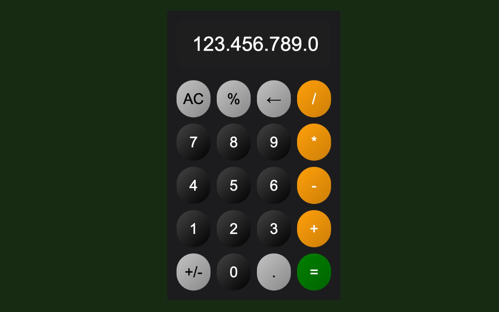
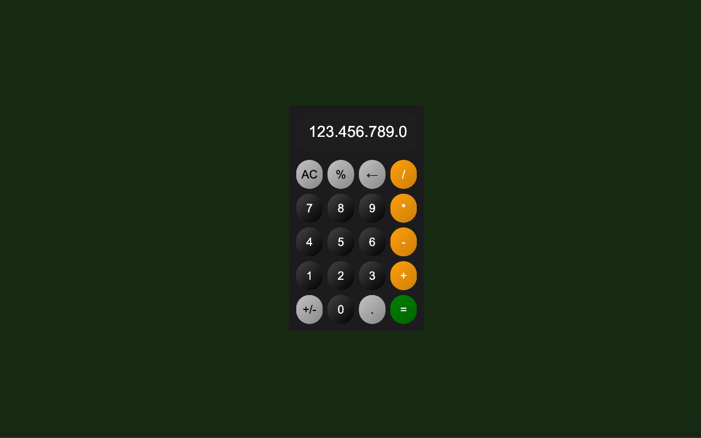

# Simple Calculator Chrome Extension

[STORE LINK](https://chromewebstore.google.com/detail/simple-calculator/cjnddigogifkmjnhdifbkckgmmenmaen?authuser=0&hl=en-US)

A basic calculator Chrome extension for quick mathematical calculations directly within your browser. This extension provides essential arithmetic operations and is designed with a clean, user-friendly interface.

## Features

- Addition, subtraction, multiplication, and division.
- Clear all and delete last digit functions.
- Percentage and negative sign toggling.
- Responsive button interactions.
- Keyboard support for ease of use.

## Installation

1. Download or clone this repository.
2. Open Chrome and go to `chrome://extensions/`.
3. Enable "Developer mode" in the top-right corner.
4. Click on "Load unpacked" and select the extension directory.
5. The calculator icon should now appear in your Chrome toolbar.

## Usage

1. Click on the calculator icon in the toolbar.
2. Use the on-screen buttons or your keyboard to perform calculations.

## Files

- `popup.html`: The main HTML file for the calculator UI.
- `scripts.js`: JavaScript logic for calculator operations.
- `styles.css`: Styling for the calculator layout and buttons.
- `manifest.json`: Chrome extension configuration.
- `background.js`: Background script to handle initial setup.
- `privacy-policy.html`: Privacy policy for the extension.

## Privacy Policy

This extension does not collect or store any personal data. Calculations are processed locally on your device.

## License

This project is licensed under the MIT License - see the LICENSE file for details.

## Contact

For more information, contact [Mehmet Ali KABA](https://www.linkedin.com/in/mehmet-ali-kaba-894257141/)
